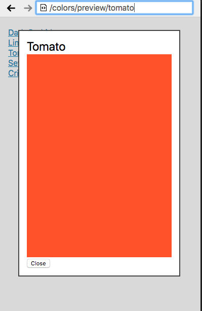

# Colorful Router 2.0

In this exercise you will be adding some more features to the app in Exercise 1.

### Specifications

- While adding new color, if the user refreshes or tries to navigate to a different url before clicking `Add this color` button, there should be an alert message showing `Are you sure you want to leave this page?`. There should be two options on this alert message. `Yes` and `Cancel`.

- Add a `preview` button on the right of each color item in the list of colors on the main page. When this button is clicked, a modal should open showing the color and the name. The url on the top should be `localhost:8000/colors/preview/:color`.

  

- As a user, if I try to navigate to a color page that does not exist (e.g. `/colors/blackpanther`), I am redirected to the colors index page.

- As a user, if I try to navigate to an invalid url (e.g. `/this-is-not-valid`), I am redirected to the colors index page.

- Use `localStorage` to persist the added colors.

