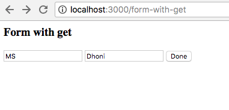
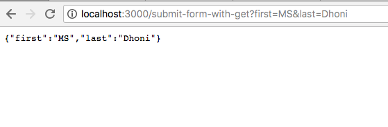

## Exercise

To start the server:
```
  yarn start
```

- There should be 5 routes in the app:

    1) `/`: GET request redirects to `/form-with-get`.

    2) `/form-with-get`: This uri corresponds to a form that submits data via a GET request. The url to which the form is submitted is `/submit-form-with-get`.

    3) `/form-with-post`: This uri corresponds to a form that submits data via a POST request. The url to which the form is submitted is `/submit-form-with-post`.

- Tasks:

    1) Add `body-parser` to parse the http request.

    2) Add ejs as the view engine in the express app.

    3) Add route `/submit-form-with-get` to handle `GET` request. Whenever a get request is sent to this uri, send a plain text response. The response should be an object with two keys: `firstName` and `lastName`. These keys should have the values matching the form values submitted by the user.

    4) Add route `/submit-form-with-post` to handle `POST` request. Whenever a post request is sent to this uri, send a plain text response. The response should be an object with two keys: `firstName` and `lastName`. These keys should have the values matching the form values submitted by the user.

  Example:

    - In the form, there are two fields: `firstName` and `lastName`. User types `MS` as first name and `Dhoni` as last name.

      

    - On submitting the form, user gets navigated to `/submit-form-with-get`.

    - On the page, the response is 

      
