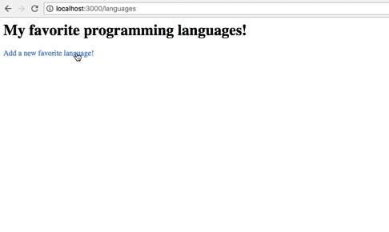

## Exercise

To start the server:
```
  yarn start
```

The objective of this exercise is to complete this application by adding routes using `express.Router`. The application has 5 views:

  >`index.ejs` page shows a list of your favorite programming languages. It has a link to `new.ejs` page where you can add a new language to your list. Each language in the list has an Edit button next to the language name. You can click on edit which will navigate you to the `edit.ejs` page. On this page you can edit the name of the language and save it. You can also delete the language from your list from the Edit page.


#### Task:

    Create routes all the desired end points according to what is described above. Use `express.Router` to create the routes. In the end, the app should work exactly like it's explained above.


