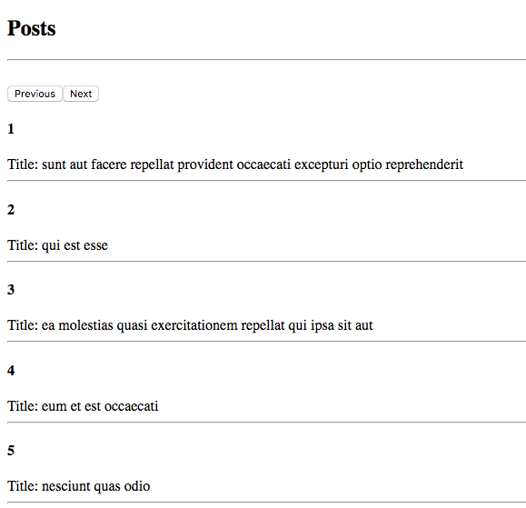

## Exercise

- Start the api server
  ```
    > cd server
    > yarn install
    > cd .. && yarn server
  ```

- Client side
  ```
    > yarn && yarn start
  ```

- Make a get request to `http://localhost:3001/posts/:page` (api server) using the [Fetch api](https://developer.mozilla.org/en-US/docs/Web/API/Fetch_API).

- Use [Postman](https://www.getpostman.com/apps) to check the response structure. Now save the response in the component state and render the posts like this:

  

- Use chrome developer tools including the console and the network tab for help if there's an error.

- You can use [localStorage](https://developer.mozilla.org/en-US/docs/Web/API/Window/localStorage) to store the current page number so that the `previous` and `next` buttons know which page to fetch.

- Create a React component to show a particular post using this endpoint: `http://localhost:3001/post/:id`. Particular post will have an additional attribute called `body`. (Would you need react-router?)

- Use [Indexed Db](https://developer.mozilla.org/en-US/docs/Web/API/IndexedDB_API) to cache the results of each post.

- If next time the same post is opened, use the cached post instead of making a get request to the server.

- In the end use your CSS skills to make the pages look presentable.

## Quiz

  After completing the exercise, answer the following questions.

1) What is a preflighted request? Was the get request you sent in the exercise a simple request or a preflighted request?

2) What is the difference between LocalStorage and SessionStorage? Give a practical scenario where you would used one over the other and why.
